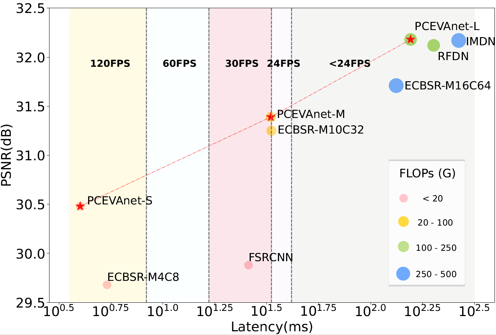
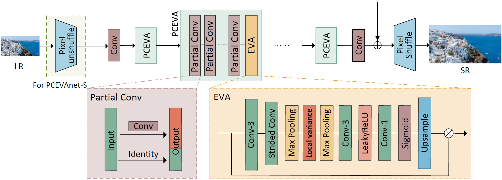
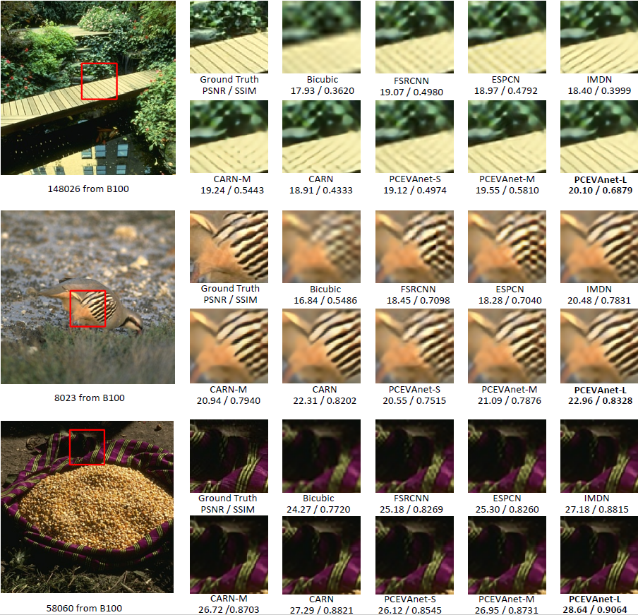

# PCEVA
This is the official PyTorch implementation of the paper *Enhancing Real-Time Super Resolution with Partial Convolution and Efficient Variance Attention* accepted by the 31st ACM International Conference on Multimedia

Our PCEVA achieves a better trade-off between performance and actual running time than previous methods. 



## Model Overview
 In this paper, we propose a simple network named PCEVAnet by constructing the **PCEVA** block, which leverages **P**artial **C**onvolution and **E**fficient **V**ariance **A**ttention. Partial Convolution is employed to streamline the feature extraction process by minimizing memory access. And **E**fficient **V**ariance **A**ttention (**EVA**) captures the high-frequency information and long-range dependency via the variance and max pooling. We conduct extensive experiments to demonstrate that our model achieves a better trade-off between performance and actual running time than previous methods. 

 

## Training and testing
We use the [BasicSR](https://github.com/XPixelGroup/BasicSR) framework for training and testing. We use the DIV2K and Flickr2K datasets for training and the dataset preparation instructions can be found [here](https://github.com/XPixelGroup/BasicSR/blob/master/docs/DatasetPreparation.md). It is recommended to use a conda environment with Python 3.9 with pytorch 1.12.1. Install other requirements by running
```
pip install -r requirements.txt
```


## Model file and other scripts
We provide the model file under the **models** directory and all the other scripts under the **scripts** directory including all the code for testing the latencies, generating the LAM map, and generating the PCEVA_results picture. An example for getting the latency in our paper is to use the ```runtime_test.py``` file under the scripts/latency_test directory
```
python runtime_test.py --scale 2 --model-name pceva  --fp16
```


## Quantitative Results of our PCEVA model
We provide pretrained models for our PCEVA-S, PCEVA-M and PCEVA-L. PSNR index is tested on the Set5 dataset. The FLOPs and inference latency are measured under the setting of generating 2560 × 1440 image

| name | scale | PSNR | latency | FLOPs | models|
|:---:|:---:|:---:|:---:| :---:|:---:| 
| PCEVA-S | x2 | 37.29 | 2.6ms | 18.3G |[models](pretrained_models/pceva_s_x2.pth)|
| PCEVA-M | x2 | 37.83 | 6.6ms | 27.6G |[models](pretrained_models/pceva_m_x2.pth)|
| PCEVA-L | x2 | 38.17 | 26.9ms | 182.2G |[models](pretrained_models/pceva_l_x2.pth)|
| PCEVA-S | x4 | 30.97 | 3.3ms | 29.1G |[models](pretrained_models/pceva_s_x4.pth)|
| PCEVA-M | x4 | 31.58 | 7.4ms | 33.0G |[models](pretrained_models/pceva_m_x4.pth)|
| PCEVA-L | x4 | 32.27 | 28.2ms | 195.6G |[models](pretrained_models/pceva_l_x4.pth)|


## More Visual Results
Images shown: 148026 ($\times$ 4) and 58060 ($\times$ 2). Performance metrics used for evaluation are PSNR and SSIM.

